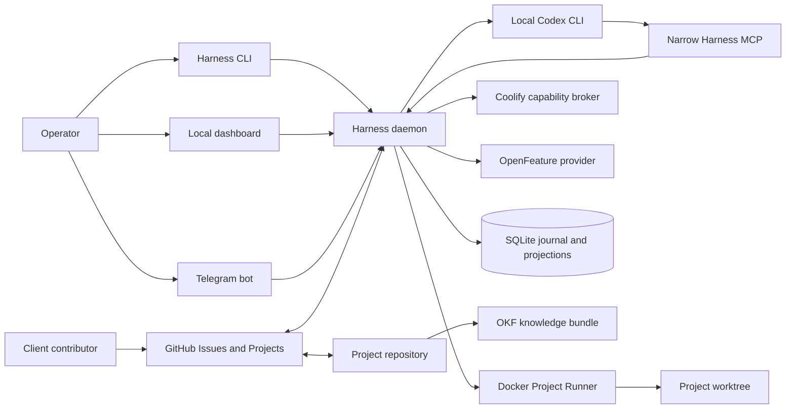
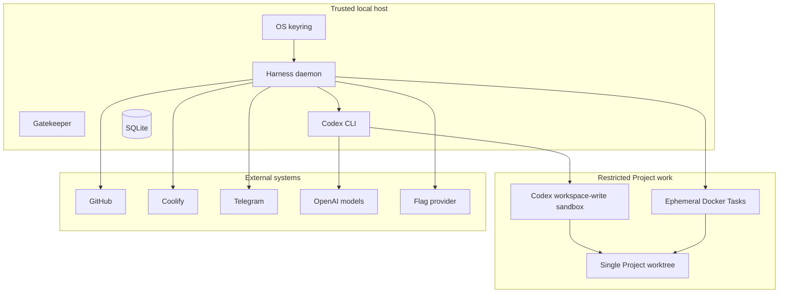

# Workflow Harness architecture

## Purpose

Workflow Harness turns a GitHub Work Item into a governed delivery loop while keeping permanent truth in GitHub and Project repositories. Local state coordinates work; it does not replace those systems.

## System context



## Trust zones



Project content, Issue text, logs, dependencies, hooks, and generated agent prose are untrusted. They never grant authority. Secrets remain in the keyring and are resolved only by trusted Modules for a single bounded operation.

## Deep Modules

| Module | Interface responsibility | Hidden implementation |
|---|---|---|
| Workflow | Process Commands, emit Events, project State, list Actions | state transitions and invariants |
| Gatekeeper | Decide whether an Action is authorized | profiles, Human Gates, policy and Actor rules |
| Execution | Start, resume, cancel, checkpoint | leases, retries, budgets, Agent Threads |
| Workspace | Prepare and close isolated work | submodules, worktrees, Git configuration |
| Project Runner | Run declared Gate or Task | Docker images, mounts, cache, limits, network |
| Knowledge | Search and propose Project knowledge | OKF traversal, FTS indexes, verification |
| Delivery | Release, deploy, expose, roll out, roll back | GitHub Release, Coolify and flags choreography |

Real seams exist for Stack Adapters, Flag Providers, Secret Stores, clocks, process runners, and telemetry exporters. GitHub, Codex, and Coolify remain concrete deep Modules until a second implementation exists.

## Local runtime

- `harnessd` runs automatically as a `systemd --user` service.
- `harness` is the operator CLI.
- The dashboard binds only to loopback and is rendered by Go templates with embedded assets.
- SQLite runs in WAL mode with one writer and rebuildable projections.
- Detailed logs rotate after 30 days; durable facts belong in GitHub, Git, or OKF.

## Repository shape

```text
cmd/harness/
cmd/harnessd/
internal/
  workflow/
  gatekeeper/
  execution/
  workspace/
  knowledge/
  delivery/
  github/
  codex/
  coolify/
  telegram/
  stack/golang/
  flags/gofeatureflag/
  platform/{sqlite,keyring,docker,telemetry}/
  dashboard/
projects/
docs/
```

Packages follow Module responsibilities rather than technical layers. Generic `utils`, `common`, `manager`, and speculative provider interfaces are prohibited.
