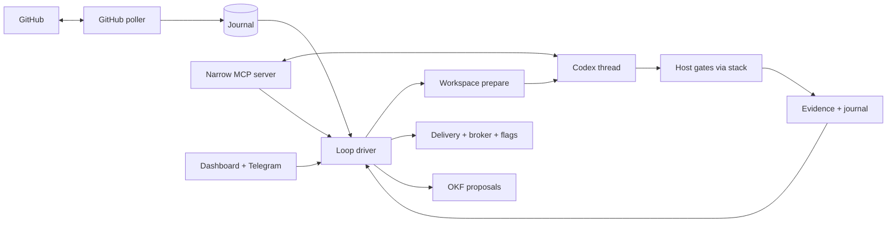

# Harness Organism — Master Plan (v2)

> **Status:** master plan. Each increment below receives its own executable TDD plan
> (`docs/superpowers/plans/`) immediately before implementation, per the repository rule.
> Prerequisites: v1 module increments 1–16 on `master`, all verified.

**Goal:** Turn the 16 verified v1 modules from policy libraries into a living system:
a `harnessd` daemon that carries Work Items from GitHub Issue to rollout using Codex
Agent Threads for cognition, while every effect crosses the same Gatekeeper, journal,
and brokers already built. Your Codex stops being run by hand and starts being
*orchestrated* — spawned per role, isolated per Execution, measured per token.

**Architecture:** one process, five seams.

- `cmd/harnessd` is a thin `main` (flags, signals, exit codes). All logic lives in
  `internal/daemon` (lifecycle, tick, dispatch) plus small new packages below.
- The daemon owns no policy: `loop` decides roles, `workflow`+`gatekeeper` authorize,
  `journal` persists, `workspace`/`runner`/`codex` execute, `delivery`/`coolify`/`flags`
  deliver, `telegram`/`dashboard` carry human intents, `knowledge`/`telemetry` record.
- Codex reaches the daemon two ways: its prompt/envelope (spawn-time context) and the
  narrow MCP server at run time (ADR 0029). Both are untrusted input to the daemon.

**Tech Stack:** Go 1.27.1 standard library plus the existing `modernc.org/sqlite` and
`gopkg.in/yaml.v3`; `harnessd` runs as a `systemd --user` service; no new dependencies
without an ADR.

## Global Constraints

- Every mutation crosses `gatekeeper` + `journal` regardless of origin (poller, MCP,
  dashboard, Telegram, CLI). No seam writes state directly.
- Secrets (GitHub App keys, Coolify tokens, Telegram bot token) live in the OS keyring,
  enter the process at boot, never enter worktrees, prompts, transcripts, logs, or SQLite.
- The daemon never trusts Agent Thread output: MCP mutating tools enqueue Commands;
  transcripts and proposals are data until verified and applied.
- Clocks stay explicit at module boundaries; the daemon is the only clock reader
  (`time.Now` at the tick edge, passed down).
- Each increment ships executable evidence on `master` before the next plan is written.
- No `utils`/`common`/`manager` packages; new code lives in `cmd/harnessd`,
  `internal/daemon`, `internal/mcp`, `internal/githublive` (name TBD at plan time).

## Increments

### 17. Daemon skeleton and tick lifecycle

**Goal:** `harnessd` boots, serves health, ticks, and shuts down gracefully with zero work lost.

**Interfaces (new):**
- `internal/daemon`: `Config{WorkspaceRoot, PollInterval, BindAddr, Token}` (+ `Validate`),
  `Run(ctx, cfg) error` (signal-aware, drains in-flight ticks before exit),
  `Tick(now) (didWork bool, err error)` driving one reconcile pass over journal state.

**Scope:** config file (`.harness/daemon.yaml`, validated, no secrets inside),
SQLite open/reopen via `journal`, loopback dashboard serving the real `dashboard.Store`,
startup recovery (`journal.Load` + resume non-terminal items). No GitHub, no Codex yet:
the tick consumes a scripted `IntakeSource` interface fed by fakes in tests.

**Verification:** `go test -race ./...`; boot→tick→SIGTERM test with an in-memory source;
`harnessd --check-config` exits 0/1; restart test proves journal state survives.

### 18. Role execution pipeline

**Goal:** One tick can carry a Work Item through prepare → thread → gates → evidence →
loop advance, end to end. Gates run on host toolchains through `stack` (containerized
`runner` gates plug in when the image catalog lands — no image mapping exists yet, and
the pipeline decisions under test are identical either way).

**Interfaces (new):**
- `internal/daemon`: `ExecuteRole(ctx, item, role) (EvidenceBundle, error)` wiring
  `workspace.Prepare` → `telemetry.Select` → `codex.Run` → `stack.Run` (per stack gates,
  host toolchains) → `delivery.Evidence` → `journal.Apply` → `loop.Advance`, with
  `workspace.Close` on terminal states and `loop` fix-cycle accounting persisted in
  `daemon-loops.json` across ticks (never in memory alone).

**Scope:** cost/duration metering into `telemetry` records per Execution; budget checks
before spawning (loop already blocks over-budget, daemon must not spawn past it);
concurrent items isolated by worktree + journal leases. Tests use stub `codex`/`docker`
binaries via `PATH` (proven pattern); real binaries behind the existing gates.

**Verification:** fixture item completes specify→implement→review→done across ticks;
gate failure resumes implementer; third failure blocks; restart mid-Execution recovers
without duplicating commands (journal idempotency).

### 19. Narrow MCP server for Agent Threads

**Goal:** Running threads can read work, fetch Spec/knowledge, run declared gates, and
request Human Gates through per-Execution authenticated tools — and nothing else.

**Interfaces (new):**
- `internal/mcp`: stdio JSON-RPC server with tools `read_work`, `get_spec`,
  `search_knowledge`, `run_gate`, `request_gate`, `propose_knowledge`; per-Execution
  bearer token minted at spawn, verified constant-time, scoped to one Work Item;
  read tools query daemon stores, mutating tools enqueue validated Commands.

**Scope:** tool schemas versioned (`mcp/v1`); every mutating call returns a command id,
never a direct effect; unknown tools/methods rejected; request/response sizes capped;
transcript of tool calls appended to the thread Evidence. No shell, SQL, Docker, raw
GitHub, or credential tools — ever (regression test enumerates the toolset).

**Verification:** conformance test drives the server over pipes (allowlisted tool works,
`exec_shell` unknown, cross-item token rejected, oversized payload rejected);
`codex` allowlists the MCP server in a fixture spawn (config, no live model by default).

### 20. GitHub wiring: poller, PRs, releases

**Goal:** Real Issues become intake, and approved work becomes real PRs, merges, and
Releases — all through the App identity, all recorded.

**Interfaces (new):**
- `internal/githublive`: cursor-based poller (`Poll(since) ([]Issue, []ProjectStatus, error)`)
  mapped through the v1 `github` reconcile into journal Commands; PR client
  (`OpenPR`, `MergePR` with method=`merge` enforced, `CreateRelease`) with every
  request/response recorded as Evidence; App installation-token provider interface
  backed by the keyring in production and a static token in tests.

**Scope:** webhook-free polling per ADR 0008 (startup + interval, deterministic resume);
third-party commits detected before any reorganization attempt (`delivery` rules);
rate-limit backoff with bounded retries. Tests run against `httptest` doubles of the
GitHub API; live runs need explicit operator tokens and stay out of default suites.

**Verification:** scripted poller run opens no PR for unapproved work and opens exactly
one merge-preserving PR per approved item in the double; token never appears in logs
or errors (assertion on captured output).

### 21. Human surfaces live

**Goal:** Dashboard and Telegram stop being validated shapes and start moving real
Work Items.

**Scope:** dashboard `Store` fed by journal projections each tick; `POST /api/commands`
validated intents applied through gatekeeper+journal (202 only after commit);
Telegram poller loop (offset-persisted in SQLite) feeding `telegram` parse → challenge
flow → same intake path; sensitive commands without verified challenges never reach
the journal (negative test with a live-format update). systemd unit file
(`systemd/user/harnessd.service`) plus `harnessd install-service` emitting it.

**Verification:** end-to-end human test over loopback + stub Telegram server:
unauthorized/foreign-origin rejected, authorized approve advances the item in the
journal; restart preserves Telegram offsets (no double-apply).

### 22. v2 acceptance: the full fixture run

**Goal:** Prove the v1 acceptance scenario continuously: external Issue → Triage →
Spec → Codex implementation → containerized Gates → independent review → preserved
commits → PR approval → immutable release → Coolify deploy → targeted exposure →
acceptance → rollout → scheduled flag removal → OKF proposal — with restart recovery
and no secret leakage.

**Scope:** a fixture harness (`internal/daemon` test package + scripted doubles: fake
GitHub, stub codex/docker, stub broker/flags) executing the whole chain across daemon
restarts; secret-canary strings planted in every input asserting absence from every
output, log, DB dump, and transcript; a `docs/acceptance.md` runbook so you can replay
it against real systems when ready.

**Verification:** one deterministic test (`TestAcceptanceScenario`) green on a clean
checkout; the runbook's real-systems variant recorded as operator evidence, not CI.

## Operator runbook (your day-to-day, once built)

1. `harness register … && harness validate …` (works today).
2. Open the Issue on GitHub; poller triages it into `inbox` within one interval.
3. You authorize in Telegram (`/authorize …`) or dashboard; Product writes the Spec.
4. Threads run unattended: implement → gates → review, with at most 3 fix cycles.
5. You approve the PR (`/approve …` + challenge); daemon merges preserving commits,
   releases, deploys disabled, exposes to target, asks acceptance, rolls out.
6. Flag removal scheduled (14d); session knowledge proposed to OKF; dashboard shows
   every state, cost, and Evidence trail on loopback.

## Risks and non-goals

- **Model quality is not this plan's problem:** evals measure the router, but judging
  output quality stays human (reviewer thread + your approval gates).
- **No multi-tenant hosting:** single operator, loopback, local-first — same as v1.
- **No auto-merge, auto-deploy, or auto-accept, ever:** the daemon prepares everything
  and waits at each Human Gate; convenience PRs that bypass gates are rejected by design.
- **Secret handling is all-or-nothing:** any leak found by a canary test blocks the
  increment, no matter how small.
