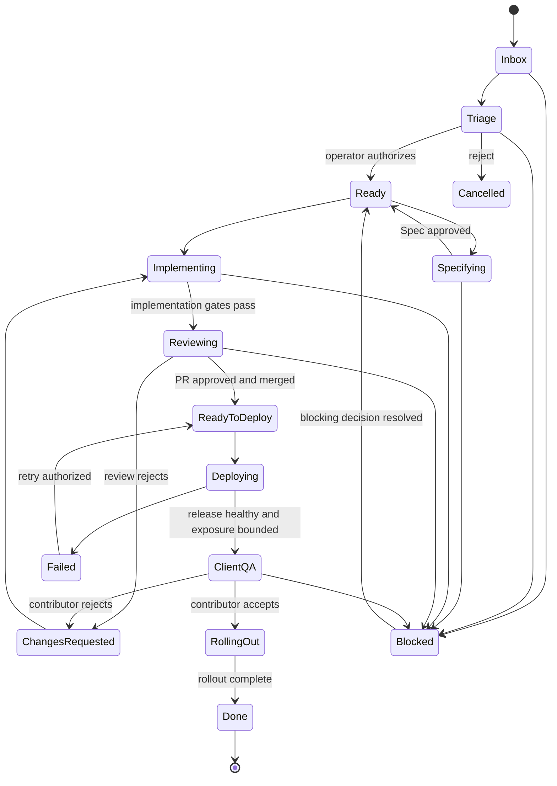
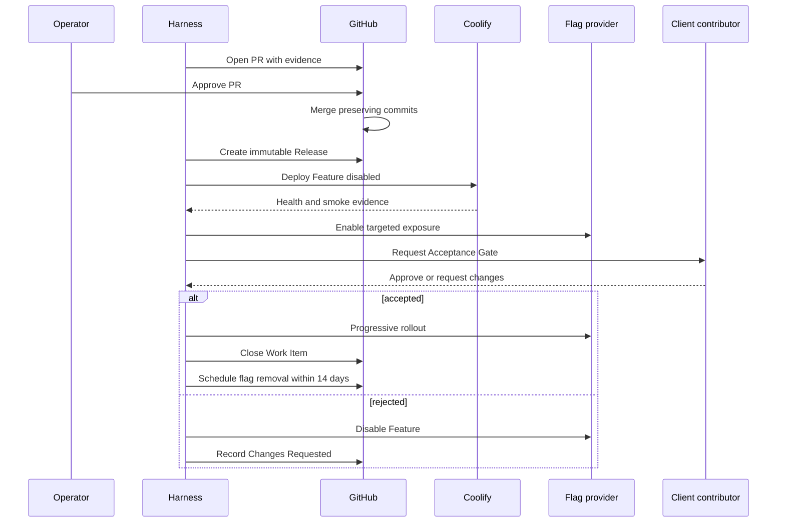

# Development workflow

## Work Item state machine

GitHub Project status is a projection and command surface. The Workflow Module owns valid transitions. Closing an Issue during an open Acceptance Gate records contributor intent but cannot bypass pending technical Gates.

## Delivery sequence

## Development loop

1. Triage treats all external content as untrusted.
2. Product produces a complete Spec with no implementation-blocking open questions.
3. The orchestrator selects only required Agent Roles.
4. Independent work may run concurrently in isolated worktrees.
5. Quality Gates produce structured Evidence.
6. Reviewer and Security use independent Agent Threads.
7. Fix cycles resume the Implementer while measurable progress continues.
8. The loop blocks after three cycles without progress, two repetitions of the same failure, a budget breach, policy conflict, or scope expansion.
9. Execution commits may be reorganized before PR creation; third-party commits are never rewritten.
10. Human approval, release, deploy, exposure, client acceptance, rollout, and flag cleanup remain separate facts.

## Quality Profile inheritance

`global default → Project minimum → Work Item override`

A Work Item may increase rigor. Lowering below the Project minimum requires a recorded Human Gate. An Agent Role cannot reduce its own Gates.

## Human Gates

Human approval is mandatory for:

- merge into a protected branch according to profile;
- production deployment according to profile;
- first infrastructure creation or structural infrastructure change;
- destructive or irreversible data migration;
- permission, secret, authentication, or security policy changes;
- rollback with possible data loss;
- configured cost overruns;
- self-modification of Harness controls;
- reduction or bypass of any Gate.
